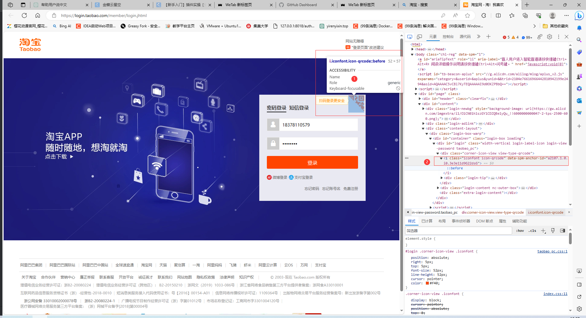
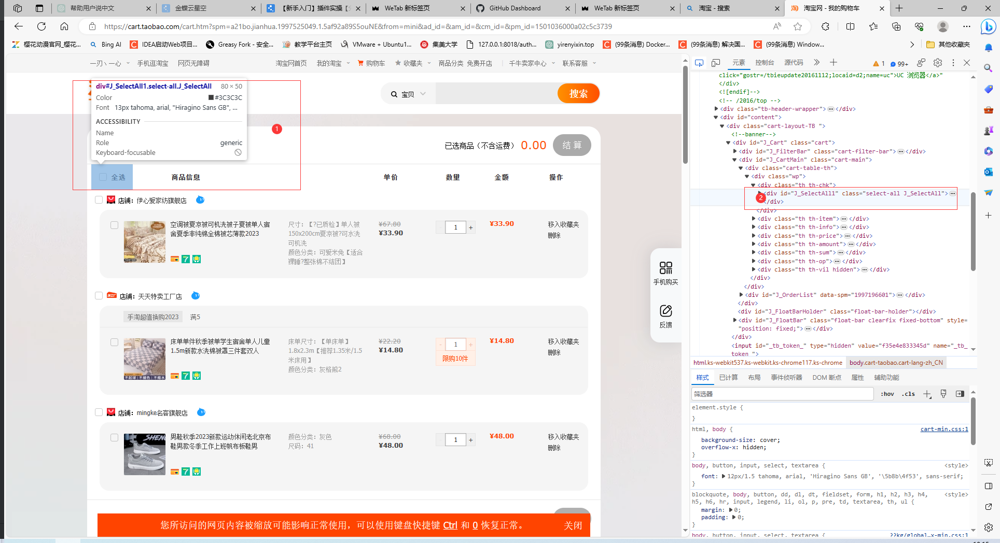
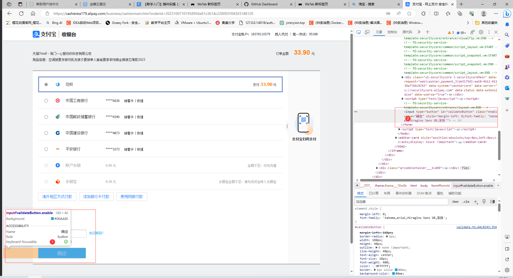
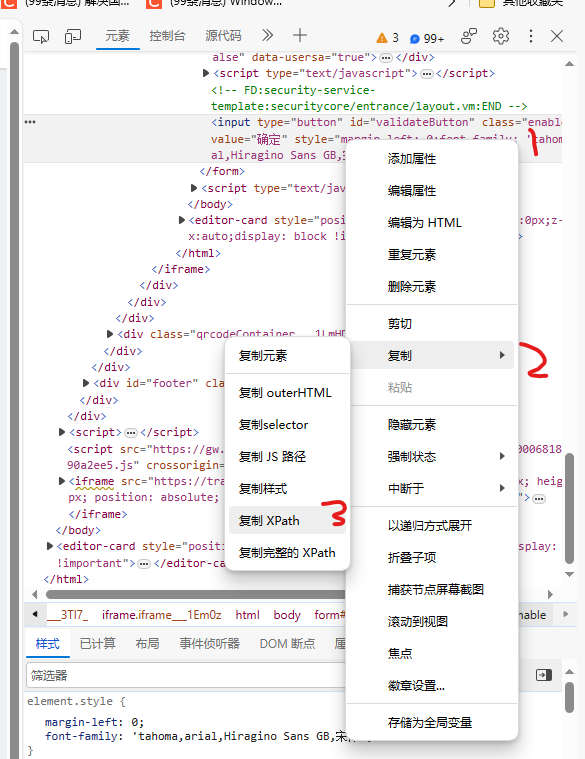

# Automatic_order_grabbing
webdriver实现简易抢单，需要根据网页进行修改（这里使用的是淘宝网页，登陆验证是滑块验证，从购物车下单，测试发现滑块验证不能通过，手动滑也也不能通过，建议手动登陆）

webdriver用的是谷歌的，记得版本要对应，也可以用其他浏览器的webdriver

java+webdriver

# 使用方法

运行src目录下的Demo.java文件，classname，id，和xpath可能会变，按照下面教程根据实际情况更改定位。


````
        //设置秒杀时间，按照格式更换成自己的时间
        SimpleDateFormat sdf = new SimpleDateFormat("yyyy-MM-dd HH:mm:ss SSSSSSSSS");
        Date date = sdf.parse("2022-07-19 10:19:00 000000000");
        
        //驱动地址，替换自己webdriver的安装路径
        String chromedriver = "C:\\Users\\yirenyixin\\AppData\\Local\\Google\\Chrome\\Application\\chromedriver.exe";
        System.setProperty("webdriver.chrome.driver", chromedriver);
        
        
        //6位密码，VK_1表示数字1，换成其他数字修改为VK_？（？填你的一位密码，如输入2改为VK_2），下面的代码输入的是111111密码。
        robot.keyPress(KeyEvent.VK_1);//模拟按下
        robot.keyRelease(KeyEvent.VK_1);//释放

        robot.keyPress(KeyEvent.VK_1);
        robot.keyRelease(KeyEvent.VK_1);

        robot.keyPress(KeyEvent.VK_1);
        robot.keyRelease(KeyEvent.VK_1);

        robot.keyPress(KeyEvent.VK_1);
        robot.keyRelease(KeyEvent.VK_1);

        robot.keyPress(KeyEvent.VK_1);
        robot.keyRelease(KeyEvent.VK_1);

        robot.keyPress(KeyEvent.VK_1);
        robot.keyRelease(KeyEvent.VK_1);
````

# 获取定位方式

这里获取定位的方式有三种。
第一种By.className()
````
        //扫码登录
        webDriver.findElement(By.className("iconfont icon-qrcode")).click();
````

第二种By.id()

````
webDriver.findElement(By.id("J_SelectAll1")).click();
````

第三种By.xpath()
````
By.xpath("//*[@id=\"payPassword_container\"]/div")
````


## By.className()


如扫描登录的class="iconfont icon-qrcode" 则
````
        //扫码登录
        webDriver.findElement(By.className("iconfont icon-qrcode")).click();
````

## By.id()


如全选的id="J_SelectAll1" 则
````
webDriver.findElement(By.id("J_SelectAll1")).click();
````

## By.xpath()


如确定按钮复制出来的xpath为//*[@id="validateButton"]则
````
By.xpath("//*[@id="validateButton"]")
````